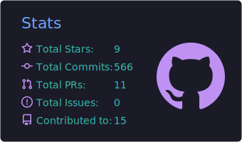
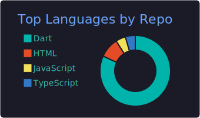

  

  

  

    
    
    
  

## About me

I'm a Software Engineer from Egypt focused on crafting polished, reliable cross-platform applications. I enjoy taking products from idea to release with maintainable architecture, thoughtful UI, and smooth performance.

- 💼 Software Engineer at **MyCash**
- 📱 Building mobile experiences with **Flutter & Dart**
- 🧩 Working with **Clean Architecture, Bloc/Cubit, REST APIs, and Firebase**
- 🌐 Also shipping web experiences with **Next.js & TypeScript**
- 🤝 Open to collaborating on useful mobile and open-source products

## Tech stack

### Mobile & languages

### Architecture & state

### Backend, data & tools

## Featured work

| Project | What it showcases | Stack |
| --- | --- | --- |
| [Teryaq - ترياق](https://muhamaadessam.github.io/projects/1) | Local-first medicine reminders, visits, health measurements, reports, and encrypted backup | Flutter, Dart, Cubit/BLoC, SQLite |
| [TMKN](https://muhamaadessam.github.io/projects/2) | Smart education platform for live sessions, recorded videos, notes, and teacher-student communication | Flutter, Dart, Cubit/BLoC, Clean Architecture |
| [Abo Eltalabat](https://muhamaadessam.github.io/projects/3) | Delivery app for meals, groceries, utility payments, offers, cart flow, and order tracking | Flutter, Dart, Riverpod, Firebase |
| [Sportsmanship](https://muhamaadessam.github.io/projects/4) | Saudi football prediction app with points, leaderboards, and real-time match updates | Flutter, Dart, Cubit/BLoC, Firebase |
| [CEO - الرئيس](https://muhamaadessam.github.io/projects/5) | Enterprise executive hub for reports, workflows, HR, productivity, and live synchronization | Flutter, Dart, Cubit/BLoC, Pusher |
| [CEO Buffet](https://muhamaadessam.github.io/projects/6) | Premium catering and buffet management with order tracking and live staff updates | Flutter, Dart, Cubit/BLoC, Firebase |

## Shipped apps

Selected production apps I worked on that are live across app stores.

| App | Store links | Focus |
| --- | --- | --- |
| Teryaq - ترياق | [Google Play](https://play.google.com/store/apps/details?id=com.teryaqy.teryaqapp) | Medicine reminders, visits, measurements, reports, and secure local backup |
| TMKN | [Google Play](https://play.google.com/store/apps/details?id=com.vroad.gsikw) · [App Store](https://apps.apple.com/kw/app/tmkn-%D8%AA%D9%85%D9%83%D9%86/id1590997791) · [Microsoft Store](https://apps.microsoft.com/detail/9pdkms7p4x4w?hl=en-us&gl=US&ocid=pdpshare) | Education platform for online lessons, video content, and notes |
| Abo Eltalabat | [Google Play](https://play.google.com/store/apps/details?id=com.aboeltalabat.customer) | Delivery, store browsing, utility payments, offers, cart, and order flow |
| Sportsmanship | [Google Play](https://play.google.com/store/apps/details?id=com.sportsmanshipapp.sportsmanship) · [App Store](https://apps.apple.com/sa/app/%D8%B1%D9%88%D8%AD-%D8%B1%D9%8A%D8%A7%D8%B6%D9%8A%D8%A9/id6474154577) | Saudi football prediction, scoring, and leaderboards |
| CEO - الرئيس | [Google Play](https://play.google.com/store/apps/details?id=sa.amazing.amazingceo) | Executive operations, reports, workflows, HR, and communication |
| CEO Buffet | [App Store](https://apps.apple.com/us/app/buffet-services/id6479214057) | Catering management, order tracking, and live staff updates |

## Contact me

  
  

## GitHub at a glance

  
  

## Contributions — the snack zone 🐍

  <picture>
    <source media="(prefers-color-scheme: dark)" srcset="https://raw.githubusercontent.com/muhamaadessam/muhamaadessam/output/github-contribution-grid-snake-dark.svg" />
    <source media="(prefers-color-scheme: light)" srcset="https://raw.githubusercontent.com/muhamaadessam/muhamaadessam/output/github-contribution-grid-snake.svg" />
    
  </picture>

  

